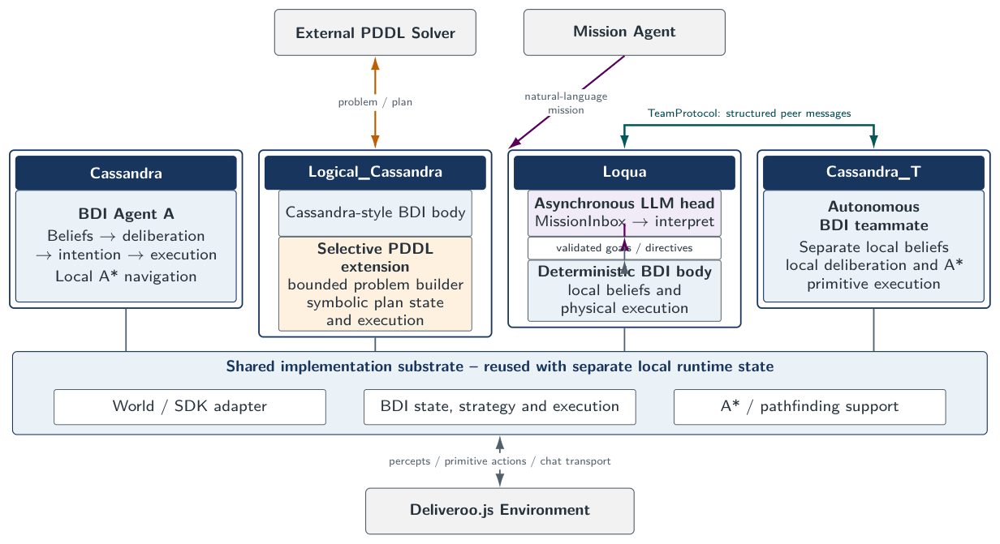
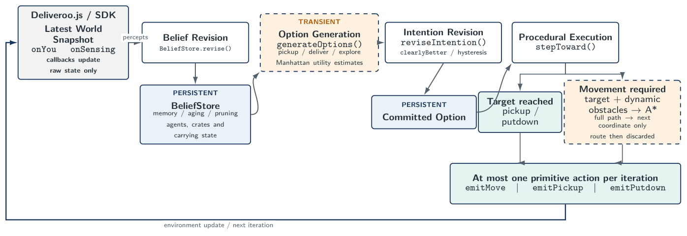
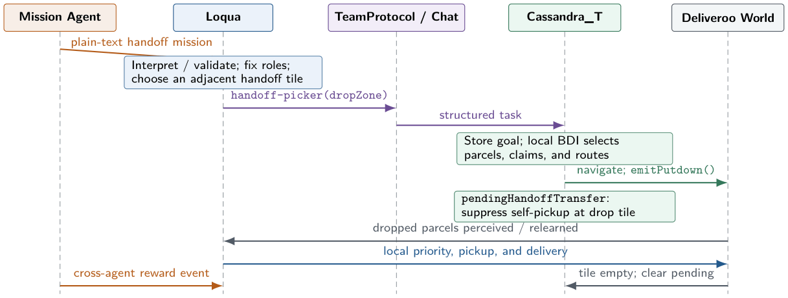

# Autonomous Software Agents — Deliveroo.js

Autonomous agents that play the **Deliveroo.js** game: they explore a grid, pick up
parcels whose value decays over time, and deliver them to the delivery zones while
competing with other players for the same parcels.

The project delivers four runnable agents:

| Agent | What it is |
|---|---|
| **Cassandra** | The BDI agent. Sense → revise beliefs → deliberate → revise intentions → act, as an explicit timed control loop. |
| **Logical_Cassandra** | Cassandra extended with **automated planning (PDDL)**: a symbolic planner solves the multi-parcel collect-and-deliver routing that greedy deliberation gets wrong. |
| **Cassandra_T** | Cassandra in **team edition**: the BDI half of the coordinated pair. |
| **Loqua** | The **LLM agent**: a BDI body driven by an LLM head that reads missions written in natural language. |

Cassandra and Logical_Cassandra are deliberately kept **separate** rather than merged:
sharing the entire BDI core and differing only in where the plan comes from is what
makes the planner's contribution measurable — run both on the same scenario and the
difference is attributable to the planner alone.

## Architecture

The four executable configurations share a common implementation substrate while
adding specialized BDI, PDDL, LLM, and coordination capabilities.



*Overall system architecture. Cassandra provides the baseline BDI controller;
Logical_Cassandra adds selective PDDL planning, while Loqua and Cassandra_T form
the coordinated LLM–BDI configuration.*

The repository mirrors this separation:

```text
core/       infrastructure: game connection, world model, pathfinding, team protocol
bdi/        the BDI layer: beliefs, deliberation, plans, strategy, directives, PDDL
llm/        the LLM layer: provider client, prompts, ReAct interpreter, tools,
            mission inbox, convenience policy, joint PDDL planner
agents/     the four entry points
test/       deterministic test suites (no network, no game server)
validation/ live validation tools (require the game and/or an LLM provider)
```
The repository follows a layered design in which the executable agents compose
functionality from the LLM, BDI, and core modules. The central design idea is that
Loqua is not a separate control architecture: it retains a deterministic BDI body
and adds a language-based mission interpretation layer on top.

## Cassandra BDI Control Loop

Cassandra follows an incremental BDI-style control loop: percepts update the world
snapshot, beliefs are revised, behavioural options are generated and ranked, and
intention revision determines whether the current commitment should be preserved or
replaced. Execution then attempts at most one primitive action before the next
belief-revision cycle.



*Cassandra's BDI control loop. The high-level intention persists across iterations,
while A* routes are recomputed when movement is required and discarded after selecting
the next step.*

## Multi-Agent Coordination

Loqua and Cassandra_T operate as independent agents with separate local beliefs and
control loops, while exchanging structured messages through the `TeamProtocol`.
Coordination changes goals, constraints, and priorities without transferring direct
control of primitive actions between agents.

The cooperative handoff mission uses fixed roles: Cassandra_T collects and drops
parcels at a selected handoff tile, while Loqua retrieves them through the environment
and completes the delivery.



*Cooperative handoff between Loqua and Cassandra_T. Loqua assigns the handoff task,
Cassandra_T autonomously collects and drops the parcels, and Loqua retrieves and
delivers them. The `pendingHandoffTransfer` state prevents Cassandra_T from immediately
re-picking parcels at the handoff tile.*

## Setup

Requires **Node.js 22** and a running Deliveroo.js server.

```bash
npm install
cp .env.example .env    # then fill in the values
```

`.env.example` documents every variable. The minimum to run the BDI agents is `HOST`;
Loqua additionally needs `LLM_BASE_URL`, `LLM_API_KEY` and `LLM_MODEL`; the team needs
`TEAM_SECRET` set to the same value for both agents.

Normal agent execution does not require bundled local copies of Deliveroo.js or
DeliverooAgent.js: npm provides the SDK/PDDL client, while `HOST` must point to a
reachable Deliveroo server. The optional live challenge validation harnesses
additionally require separately obtained official Deliveroo resources; see
[validation/README.md](validation/README.md).

## Running

Each agent is a separate process and connects under its own name, so any combination
can share a map:

```bash
npm run cassandra           # Agent A — BDI
npm run logical-cassandra   # Agent A + PDDL
npm run cassandra-team      # Agent A, team edition   ┐ run both together
npm run loqua               # Agent B — LLM           ┘ for the coordinated team
```

Useful environment switches:

```bash
PROFILE=ECO npm run cassandra      # ECO | BALANCED | RICH
AGING=0 npm run cassandra          # flip one lever for a controlled ablation
DEBUG_LOG=1 npm run cassandra      # log every intention change
DEBUG_LLM=1 npm run loqua          # log the full ReAct trace of each interpretation
```

## Tests

The deterministic suites need neither the game nor the network:

```bash
npm test                    # all four suites
npm run test:interpreter    # ReAct runtime guards, against a scripted mock model
npm run test:policy         # convenience policy + directive compilation
npm run test:team           # handshake, impostor rejection, claim races
npm run test:pddl           # STRIPS encoding invariants of the joint-meet problem
```

The interpreter suite also has an opt-in live half that probes real models:

```bash
node test/interpreter.test.js --live [model ...]
```

## Validation

Tools used to validate behaviour that unit tests cannot reach, because it only exists
in a live game:

```bash
npm run mission-suite       # model grid + adversarial battery (needs an LLM provider)
node validation/meet-mission.js <ADMIN_TOKEN>   # rendezvous mission agent
node validation/impostor.js                     # hostile agent with the wrong secret
```

For the three live challenge harnesses, canonical evidence, and their external
prerequisites, see [validation/README.md](validation/README.md). These are optional
runtime checks; they are distinct from the deterministic test suite above.

## Code conventions

ES modules, JSDoc types checked with `checkJs` + `strict` (see `jsconfig.json`), no
build step — the types are documentation that the compiler verifies:

```bash
npm run typecheck
```

This reports **no errors in the project's own sources**. The only two diagnostics come
from a JSDoc annotation inside the game SDK's own files, under `node_modules/`.
